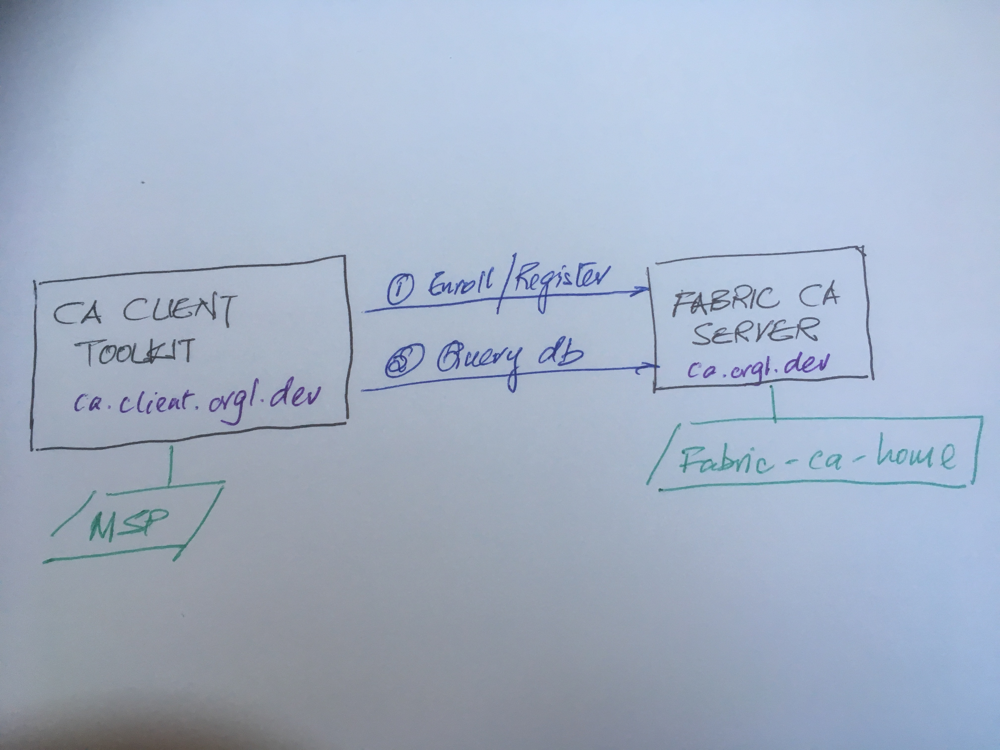

## Overview

This demonstrator uses a combination of `fabric-ca-client` cli, `docker` and `bash scripts` acting as a client node connecting to a instance of `fabric-ca-server`

In this demonstrator, you will find the following artefacts:

* A Dockerfile to help you build an image of `fabric-ca-client`.
* A Docker Compose file create a running instance of `fabric-ca-client` container and a running instance of `fabric-ca-server` container.
* Enroll a registrant who is designated to register a credential (see script [registring-admin2.sh](../extensions/fabric-ca-client/scripts/registering-admin2.sh));
* Revoke a credential (see script [revoke-idenity.sh](../extensions/fabric-ca-client/scripts/revoke-idenity.sh));
* Perform ad hoc query (see note for technical limitation) of Fabric CA database (see script [query.sh](../extensions/fabric-ca-client/scripts/query.sh))).

> NOTE:
> The Fabric CA server in this case uses sqlite.

<figure>

    
    <figcaption>Figure 1: Fabric CA and ca client interactions</figcaption>

</figure>

The demonstrator has been verified to work on macOS these versions of Hyperledger Fabric components:

| Component | Version |
| :-- | :-- |
| FABRIC_CA | 1.4.4 |
| macOS | Catalina |
| Docker | version 19.03.4, build 9013bf5 |

## How to use this demonstrator

To use it to enroll and register users in the dev network's Fabric CA server please perform the following steps:

1. `git clone https://github.com/fabric-devkit/core-ca` and `navigate` into the core-ca folder.

2. Run the command `./fabricOps.sh start`, to instantiate a running Fabric CA client and server. This will open up a cli in the `fabric-ca-client` container simiilar to this:

   ```shell
   root@ca1a0eb25240:/opt#
   ```

3. You can:
   a. registration a credential name `admin2` by running the command `root@594ed3d57171:/opt# ./scripts/registering-admin2.sh`, or
   b. revoke an identity by running the command `root@594ed3d57171:/opt# ./scripts/revoke-identity.sh` or
   c. perform an ad hoc query of the Fabric CA `root@594ed3d57171:/opt# ./scripts/query.sh`.

4. You can observed the end result of the Fabric CA client interaction with Fabric CA server via these folders: 

   a. `./fabric-ca-server` folder, this containers the internals of server;

   b. `./fabric-ca-client-home` folder, this contains `msp` at the client ent.

## Copyright Notice

Copyright (c) 2019. The Fabric-DevKit Authors. All rights reserved.
SPDX-License-Identifier: Apache-2.0